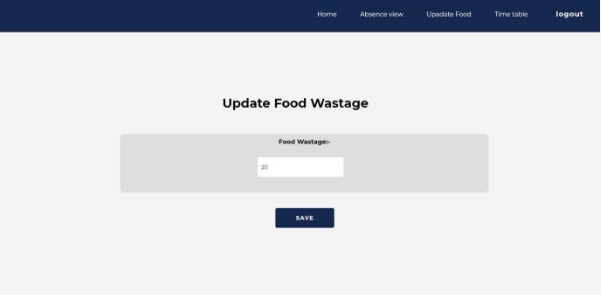
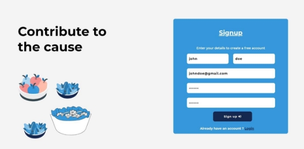
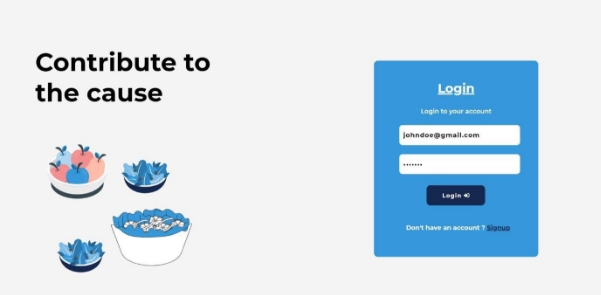
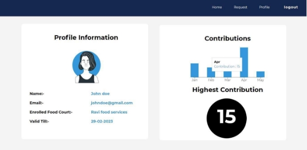

**Results and screenshots of Food Management System**

Admin Signup   

To manage the resources with the help of the consumers the resource managers should sign up by  providing  necessary  details.  The  email  address  should  be  provided  correctly  and  the password must be strong and must contain number alphabets and must contain characters such as @, #.  

Admin Login  

To login into the website the resource manager should login with their credentials that they used while signing up, if new then the resource manager must sign up.  

Update the food items  

Once logged in, the resource manager can see the home page. Here the resource manager can update the menu and add food items to be prepared for lunch and dinner within the respective time duration given. The resource manager should also update the food cooked  of the day so that it will be added to the statistics and calculations.  

Dash board  

This page provides the details of total number of consumers, the food that was cooked for that day. Along with statistics of food wastage and attendees i.e., the total wastage of food and the number of consumers who attended in the previous is shown. Likewise, it shows the present day’s statistics of food and attendees.  

Absence view (Check the non-attendees for lunch / dinner)  

Here the admin has the access to check the number of attendees for lunch / dinner. Also he can submit any urgent that can be conveyed to the users.  

Update food wastage  

The admin can update the wastage of the food for that day so that it can be stored for statistical display and can help resource managers to manage more efficiently.  

User signup page  

First user must sign-up and give the respective details First name, Last name, Email, Password. First name and last name must be given in relevance to enrolled organization you are a part of. The password must be strong and must contain number alphabets and must contain characters such as @, #.  

User login page  

To login to the website, one needs to give their email and pre-set password which are given during the sign-up of the user. If you are a new user one must click on signup, give in the above- mentioned details.  

User request page  

Requests can be sent by the users when they are not attending the respective lunch, Dinner. This gives the vendor information that the user was not able to attend his/her mess. So that the vendor can make changes accordingly and reduce the food that is prepared.  

User homepage  

The home of the user consists the menu and no of items served that is being served during the opted duration or for lunch and dinner. It also gives the times when the lunch and dinner open and closes at.  

User profile page  

After sign-up or login to the website he/she will be redirected to profile page. The profile gives details such as name, email, validity of the credentials and also gives details of the contributions made by the user in the subsequent week-days or the months when user made a contribution.**  
